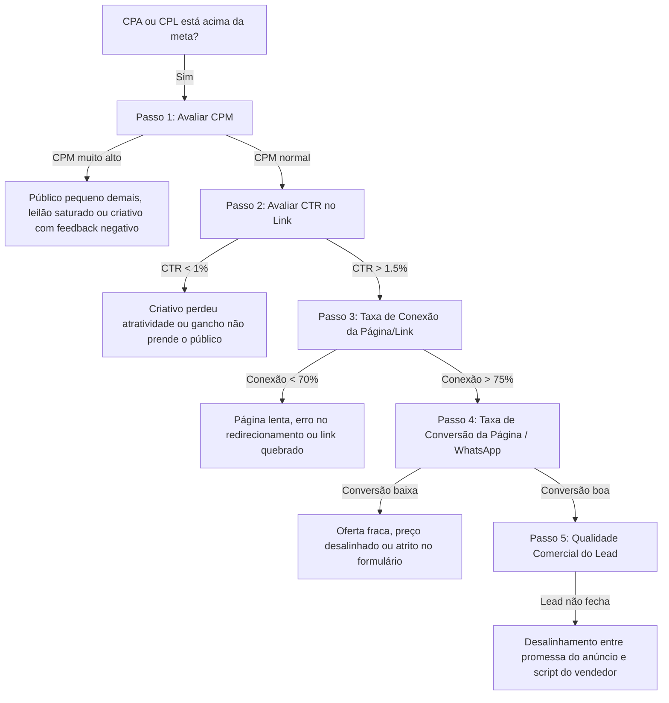

# 🔍 Skill: Auditoria de Dados & Diagnóstico de Desempenho

## 🎯 Objetivo
Diagnosticar com precisão cirúrgica por que uma conta de tráfego parou de vender, aumentou os custos ou não está entregando o resultado esperado, substituindo palpites por engenharia de dados.

---

## 🧭 A Árvore de Decisão do Diagnóstico (Troubleshooting)

---

## 📊 Matriz de Métricas e Benchmarks de Referência

| Métrica | Benchmark Saudável | Ação se estiver Ruim |
|---|---|---|
| **CPM (Custo por Mil)** | R$ 15,00 a R$ 35,00 (Brasil B2C/Local) | Ampliar raio geográfico, remover segmentações hiper-restritas ou testar novos ganchos visuais. |
| **CTR no Link (Todos)** | $> 1.5\%$ (Meta Ads) | Trocar os primeiros 3 segundos do vídeo ou mudar imagem estática. |
| **Taxa de Conexão (Landing Page Views / Cliques)** | $> 75\%$ | Otimizar imagens com WebP, reduzir scripts pesados e verificar CDN. |
| **Taxa de Conversão na LP** | $15\% - 30\%$ (Leads) / $1.5\% - 3\%$ (E-commerce) | Simplificar formulário, colocar CTA na 1ª dobra e adicionar provas sociais reais. |
| **Custo por Conversa / Lead** | Definido pelo modelo de margem (ex: $\le$ R$ 25 no plano piloto) | Desligar criativos caros e realocar verba nos anúncios com menor CPL. |
| **Frequência (7 dias)** | $< 2.2$ (Topo) / $< 6.0$ (Remarketing) | Saturação de audiência. Renovar criativos ou expandir público. |

---

## 🛠️ Procedimento Operacional Padrão (SOP) de Auditoria

### 1. Verificação Técnica de Saúde (Sanity Check)
* O pixel/dataset está disparando o evento correto no navegador?
* A API de conversões (CAPI) está ativa e com nota de qualidade acima de 7.5?
* As UTMs estão preenchidas para rastreamento no CRM ou Google Analytics 4?

### 2. Análise por Janelas Temporais
* Comparar os **últimos 3 dias** contra os **últimos 7 dias** e os **últimos 14 dias**.
* Verificar se a queda de desempenho foi pontual (ex: instabilidade no Meta) ou se é uma tendência de queda constante.

### 3. Matriz de Decisão de Intervenção
* **PAUSAR IMEDIATAMENTE:** Qualquer anúncio que tenha gastado mais que $2\times$ o CPA alvo sem gerar nenhuma conversão.
* **MANTER EM OBSERVAÇÃO:** Anúncios com menos de 3 dias no ar e investimento abaixo de $1\times$ o CPA alvo.
* **ESCALAR (+15% a +20%):** Conjuntos com CPA pelo menos 20% abaixo da meta nos últimos 7 dias.

---

## ✅ Checklist de Entrega da Auditoria
- [ ] Gargalo principal identificado de forma unívoca (CPM, CTR, Taxa de Conexão ou Fechamento).
- [ ] Lista de anúncios pausados por desperdício de verba.
- [ ] Sugestão de pelo menos 2 novos ganchos para substituir os criativos saturados.
- [ ] Relatório claro para o cliente ou liderança técnica explicando os dados sem jargões desnecessários.
