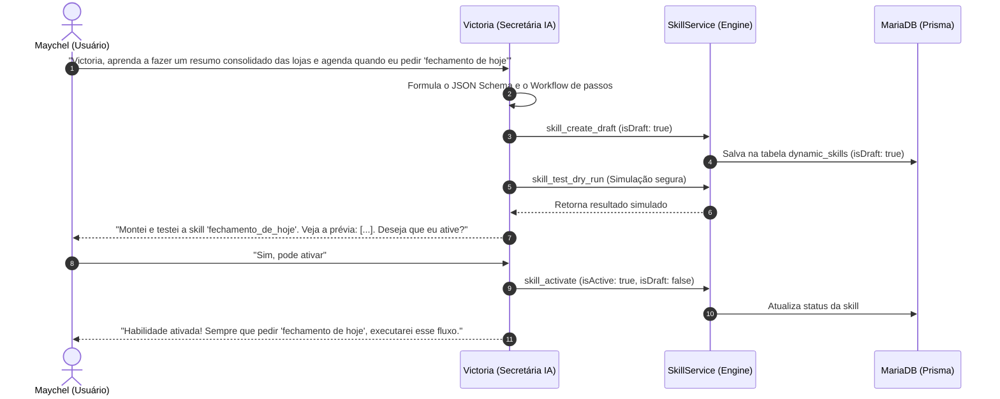

# 🧠 Guia Arquitetural: Dynamic Skills Engine (Habilidades Dinâmicas)

O **Dynamic Skills Engine** permite que a **Secretaria IA (Victoria)** aprenda, teste, persista no MariaDB e execute fluxos de trabalho compostos em tempo de execução, funcionando com **alta confiabilidade determinística**, validação prévia (*Dry-Run*) e **custo mínimo de tokens**.

---

## 🎯 Por que Skills Dinâmicas?

| Abordagem Tradicional (Chatbot) | Dynamic Skills Engine (Victoria) |
| :--- | :--- |
| Tenta lembrar rotinas longas via prompt solto | Estrutura fluxos como grafos/passos ordenados de ferramentas |
| Alto risco de alucinar ou esquecer parâmetros | Schema estrito de entrada e tipagem via Zod / JSON Schema |
| Custo alto (envia prompts gigantes em todo chat) | **Tool Gating Contextual**: só injeta a skill quando solicitada |
| Sem auditoria de execução | Registra histórico detalhado com duração e status no MariaDB |

---

## 🔄 Ciclo de Vida de uma Skill



---

## 🏗️ Especificação de uma Skill (JSON Schema)

Cada skill é representada pelo seguinte contrato:

```json
{
  "name": "resumo_executivo_semanal",
  "displayName": "Resumo Executivo Semanal de Lojas e Tarefas",
  "description": "Cruza faturamento de 7 dias das duas lojas com as tarefas pendentes da semana e gera um briefing consolidado.",
  "triggerExamples": [
    "resumo semanal executivo",
    "como foi a semana das lojas e tarefas",
    "fechamento semanal geral"
  ],
  "parametersSchema": {
    "type": "object",
    "properties": {
      "days": {
        "type": "number",
        "description": "Período em dias para cálculo das vendas (padrão: 7)"
      }
    }
  },
  "workflow": [
    {
      "id": "step_vendas",
      "type": "tool_call",
      "toolName": "klimaparts_get_consolidated_report",
      "args": {
        "days": "{{input.days}}"
      },
      "outputKey": "dadosVendas"
    },
    {
      "id": "step_tarefas",
      "type": "tool_call",
      "toolName": "list_tasks",
      "args": {
        "status": "PENDING"
      },
      "outputKey": "dadosTarefas"
    },
    {
      "id": "step_formata",
      "type": "format_template",
      "template": "📊 *FECHAMENTO SEMANAL CONSOLIDADO*\n\n💰 Vendas:\n{{steps.dadosVendas.markdown}}\n\n📋 Tarefas Pendentes:\n{{steps.dadosTarefas.count}} tarefas restantes na fila.",
      "outputKey": "relatorioFinal"
    }
  ]
}
```

---

## ⚡ Interpolação de Variáveis

O mecanismo suporta variáveis encadeadas:
* `{{input.nomeDoParametro}}` ➔ Acessa parâmetros passados na chamada inicial.
* `{{steps.stepId.propriedade}}` ➔ Acessa saídas de passos anteriores já executados.

---

## 🛡️ Ferramentas Disponíveis para o Agente (Tools)

| Ferramenta | Descrição |
| :--- | :--- |
| `skill_create_draft` | Cria e estrutura um novo rascunho de fluxo de trabalho. |
| `skill_test_dry_run` | Roda uma simulação da skill para validar integridade antes do deploy. |
| `skill_activate` | Ativa ou desativa a skill no catálogo de produção. |
| `skill_list` | Lista todas as habilidades aprendidas e seus contadores de execução. |
| `skill_delete` | Remove uma habilidade obsoleta. |

---

## 📡 Endpoints da API REST

* `GET /api/skills` — Lista todas as skills cadastradas.
* `POST /api/skills` — Cadastro/atualização manual de uma skill.
* `GET /api/skills/:id` — Consulta detalhes de uma skill.
* `POST /api/skills/:id/test` — Executa um Dry-Run da skill com parâmetros de teste.
* `POST /api/skills/:id/run` — Executa a skill diretamente em produção.
* `PATCH /api/skills/:id/toggle` — Ativa / Pausa a skill.
* `DELETE /api/skills/:id` — Remove a skill do banco.
